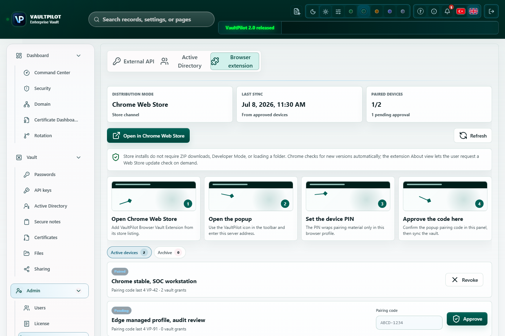

# VaultPilot Browser Vault Extension

VaultPilot Browser Vault Extension provides paired-device access to vault records through user-action autofill, save-login prompts, update-login prompts and active-site record-count badges.

This sanitized UI capture uses synthetic data and shows Chrome Web Store distribution, approved-device count, pairing steps, and device approval controls. Visible device names, counts, codes and timestamps are documentation fixtures, not production guidance.

## Install From Chrome Web Store

The supported customer install path is the Chrome Web Store listing:

`https://chromewebstore.google.com/detail/vaultpilot-browser-vault/hjkbedlaieikhkoplgpiohlaakgebobi`

Older store URLs may redirect from a historical slug. The supported extension identity is the published extension ID `hjkbedlaieikhkoplgpiohlaakgebobi`.

For managed fleets, deploy that Web Store extension ID through Chrome or Edge policy. Chrome handles automatic extension update checks from the Web Store. The extension About view can request a Web Store update check, but Chromium may throttle checks and only applies an update when the browser reports one as available.

The release ZIP is kept only for release archives, lab validation, local development, and emergency fallback. Do not use the ZIP as the normal customer installation path.

Store listing text, privacy practice answers, permission justifications, and screenshot rules are maintained in [Chrome Web Store listing and privacy](chrome-web-store-listing.md).

## Pairing Flow

1. Install VaultPilot Browser Vault Extension from the Chrome Web Store.
2. Open the extension popup.
3. Enter the VaultPilot server origin.
4. Enter username, device name and extension PIN.
5. The extension creates a short-lived pairing code.
6. Approve the device in VaultPilot: Browser extension.
7. VaultPilot wraps vault access for the extension public key.

## User Experience

| Feature | Behavior |
| --- | --- |
| Badge count | The extension icon shows the number of matching records for the current site. |
| Autofill | User action fills the selected record into the current page. |
| Save login | New login detection can prompt the user to save a new record. |
| Update login | Changed username/password detection can prompt the user to update an existing record. |
| Notifications | Pairing, revocation, autofill and save/update states are shown in the popup and browser notification surface where supported. |

## Security Model

- Extension private material is protected by the extension PIN and browser profile storage.
- Persistent extension storage does not contain plaintext secrets.
- Autofill snapshots contain encrypted payloads and extension-wrapped keys.
- Plaintext is decrypted only in the active extension session after user action.
- Lost or untrusted devices should be revoked from the VaultPilot panel.

## Operations Checklist

- Pair only named devices.
- Use the Chrome Web Store listing for user installs and updates.
- For managed fleets, distribute the Web Store extension ID through browser policy.
- Review the Browser extension screen after updates.
- Revoke devices that are unused, unknown or no longer compliant.
