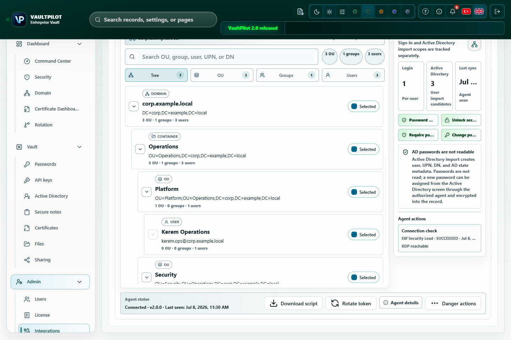

# Active Directory ve VaultPilot DC Agent Service

VaultPilot DC Agent Service domain controller'a yakın bir Windows host üzerinde çalışır ve dizin metadata'sını VaultPilot'a senkronize eder. AD bind parolasını veya AD kullanıcı parolalarını VaultPilot'a göndermez.



Bu yayıma uygun hale getirilmiş UI görseli yalnızca sentetik veri içerir. Provider sağlığını, base DN bilgisini, OU/grup/kullanıcı seçimini, login kapsamını, credential import kapsamını ve ajan aksiyonlarını gösterir. Görünen kullanıcılar, domain'ler, sayılar, zaman damgaları ve aksiyon durumları dokümantasyon örneğidir; production rehberi değildir.

## Servis Kimliği

| Öğe | Değer |
| --- | --- |
| Servis adı | `VaultPilotDCAgent` |
| Görünen ad | `VaultPilot DC Agent Service` |
| Config dosyası | `%ProgramData%\VaultPilot\ad-agent\vaultpilot-dc-agent.json` |
| Servis logu | `%ProgramData%\VaultPilot\ad-agent\vaultpilot-dc-agent-service.log` |
| Agent logu | `%ProgramData%\VaultPilot\ad-agent\vaultpilot-ad-agent.log` |

`%ProgramData%` fallback çalışması sırasında yazılabilir değilse script agent logunu `%LOCALAPPDATA%\VaultPilot\ad-agent\vaultpilot-ad-agent.log` altında yazar.

## Kayıt Akışı

1. VaultPilot'ta Entegrasyonlar -> Active Directory ekranını açın.
2. Ajan kaydı oluşturun.
3. Release asset'lerinden veya UI üzerinden `vaultpilot-dc-agent.ps1` dosyasını indirin.
4. Ajan makinesinde Administrator PowerShell ile kurulum komutunu çalıştırın.

```powershell
powershell -NoProfile -ExecutionPolicy Bypass -File "$env:USERPROFILE\Downloads\vaultpilot-dc-agent.ps1" -InstallService -PassManUrl "<VAULTPILOT_URL>" -AgentId "<AGENT_ID>" -AgentToken "<AGENT_TOKEN>" -TrustPassManCertificate
```

Üretilen 2.0 komutu hâlâ `-PassManUrl` ve `-TrustPassManCertificate` gibi flag adları kullanabilir. Bunları mevcut agent script yüzeyinden gelen compatibility flag adları olarak ele alın; release script VaultPilot alias'ları eklemeden bu adları elle değiştirmeyin.

Script şu bilgileri ister:

- Domain controller IP veya hostname.
- AD bind kullanıcı adı.
- Lokal terminal prompt'u üzerinden AD bind parolası.

Parola lokalde alınır, loglara yazılmaz ve VaultPilot'a post edilmez.

## Operasyon Komutları

```powershell
powershell -ExecutionPolicy Bypass -File .\vaultpilot-dc-agent.ps1 -Status
```

```powershell
powershell -ExecutionPolicy Bypass -File .\vaultpilot-dc-agent.ps1 -TailLog
```

```powershell
powershell -ExecutionPolicy Bypass -File .\vaultpilot-dc-agent.ps1 -RepairService
```

Kurulu servis için mevcut provider kartındaki token döndürme komutunu kullanın. Üretilen repair komutu aynı Windows servisini korur, DC host ve bind kullanıcı adını koruyabilir veya güncelleyebilir. VaultPilot 2.0.0 ve daha yeni sürümlerde yeni üretilen veya döndürülen agent token'ları sunucudaki server-secret/data-directory bağlam kaymasından bağımsız yetkilendirilir; aynı düzeltme ilk olarak PassMan 1.8.19 compatibility line içinde yayımlandı.

```powershell
powershell -ExecutionPolicy Bypass -File .\vaultpilot-dc-agent.ps1 -UninstallService
```

## VaultPilot'ta Görünenler

Senkron sonrası Active Directory sekmesi şunları gösterir:

- Sağlayıcı durumu ve son senkron zamanı.
- Domain controller, domain, base DN ve ajan sürümü.
- Aramalı OU, grup ve kullanıcı ağacı.
- Login erişimi ve credential import için ayrı checkbox kapsamları.
- Seçili credential adayları için import aksiyonu.

## Sıkılaştırma Notları

- Bind kullanıcısı için `DOMAIN\username` veya `username@domain.local` tercih edin.
- Senkron ihtiyacını karşılayan en dar yetkili delegated hesabı kullanın.
- Ajanı DC'ye yakın, kontrollü bir Windows host üzerinde çalıştırın.
- Kurulum komutu güvenli olmayan bir kanala kopyalandıysa agent token'ı döndürün.
- Ajan makinesi yeniden kuruluyorsa kaydı VaultPilot UI üzerinden iptal edip yeniden oluşturun.

## Sorun Giderme

| Belirti | Aksiyon |
| --- | --- |
| Servis kurulmuyor | Administrator PowerShell kullanın ve servis logunu inceleyin. |
| Wrapper compile hatası | En güncel `vaultpilot-dc-agent.ps1` kullanın; repair akışı eski servisi durdurup wrapper'ı güvenli şekilde yeniden oluşturur. |
| VaultPilot URL erişilemiyor | Ajan makinesinden URL'yi test edin, firewall/DNS yolunu doğrulayın. |
| Kurulum veya repair 401 Unauthorized döndürüyor | VaultPilot 2.0.0 ve daha yeni sürümlerde yayınlanmış release veya içeride onaylanmış build kullanın. Eski compatibility kurulumlarında PassMan 1.8.19 veya daha yeni sürümü kullanın. Sonra provider token'ını döndürüp gösterilen komutu tekrar çalıştırın. Devam ederse server logunda redakte edilmiş `provider_not_found`, `token_revoked`, `token_missing` veya `token_mismatch` sebebini kontrol edin. |
| Senkron sıfır nesne gösteriyor | Bind hesap kapsamını ve base DN değerini kontrol edin. |
| Ajan bağlı ama ağaç bayat | Şimdi senkronize et aksiyonunu kullanın, sonra servis ve ajan loglarına bakın. |
