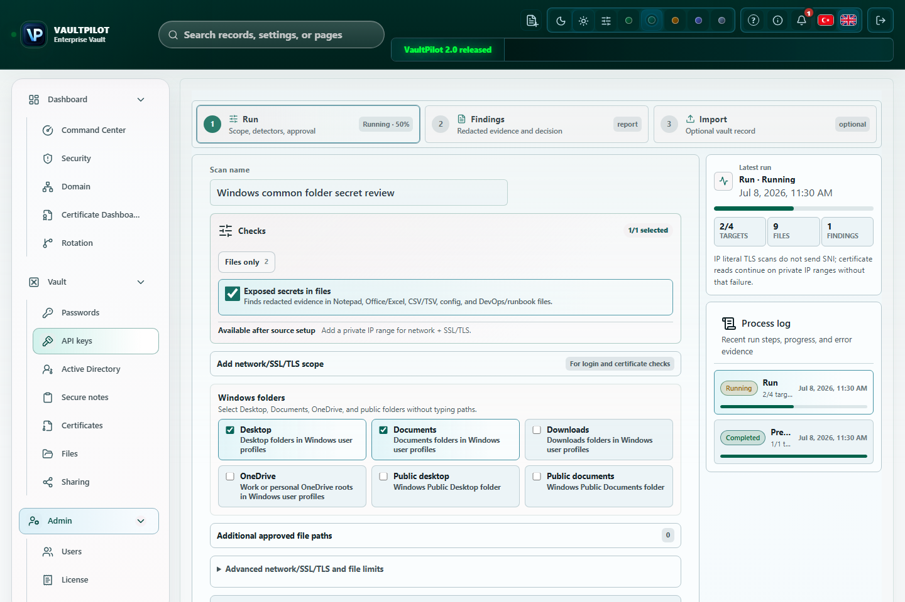
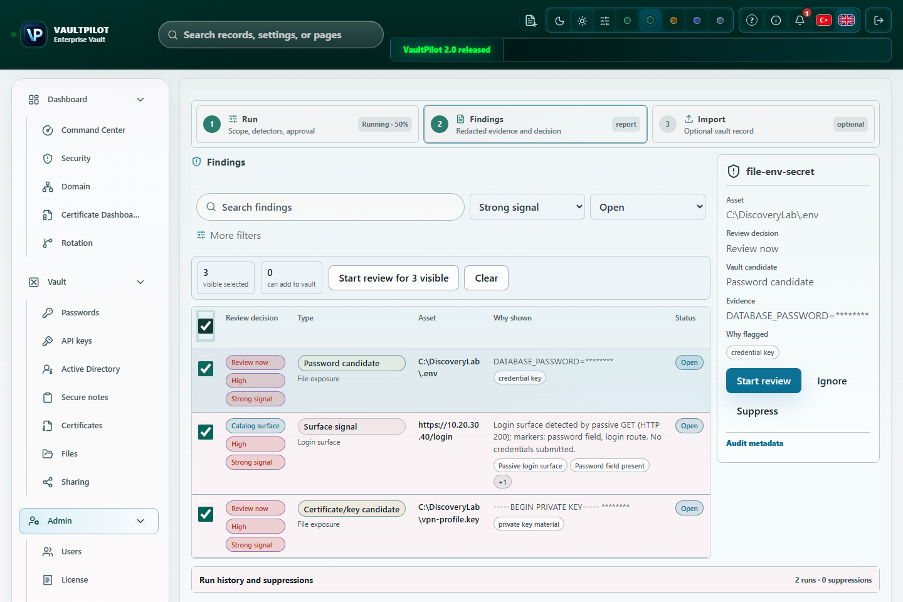
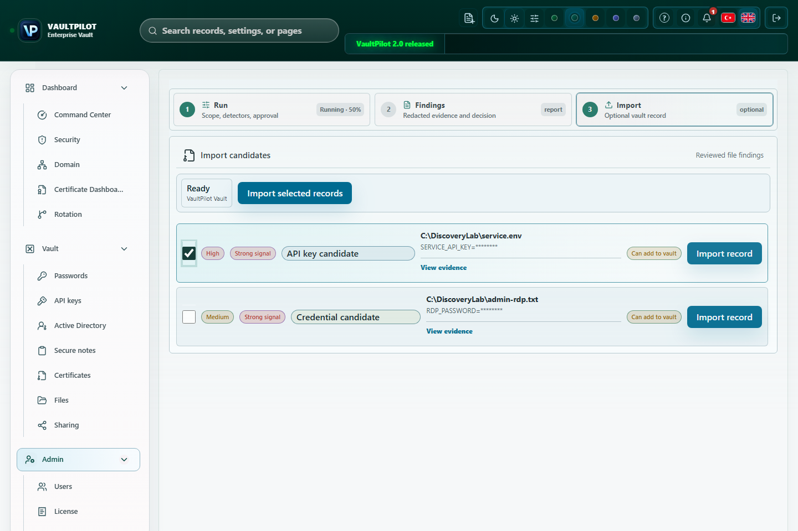

# VaultPilot Discovery

VaultPilot Discovery, yetkili operatörler için kontrollü exposure-review çalışma alanıdır. Şifreli kasanın dışında kalmış login yüzeyleri, sertifika riskleri ve secret içeriyor gibi görünen dosyaları güvenli şekilde incelemeye yardım eder.

Discovery PAM, asset inventory, RDP veya SSH yönetimi, vulnerability scanner, malware scanner ya da otomatik temizlik aracı değildir. Read-only sinyal ve inceleme akışıdır; karar operatörde kalır.

Screenshot notu: Discovery görselleri izole bir VaultPilot çalışma ortamı üzerinde sentetik veriyle alınmış yayıma uygun UI capture'larıdır. Görünen path'ler, değerler, evidence hash'leri ve bulgu durumları dokümantasyon örneğidir; bulgu kanıtı maskelidir.

## Discovery Neyi İnceler

| Alan | VaultPilot neyi kontrol eder | Operatör sınırı |
| --- | --- | --- |
| Özel network ve TLS | Onaylı private IP, CIDR, range, TCP, TLS ve pasif HTTP login işaretleri. | Varsayılan olarak public internet taraması yoktur. Credential gönderimi yoktur. |
| Windows klasör presetleri | Server çalışma hesabı için Desktop, Documents, Downloads, OneDrive, Public desktop ve Public documents. | Preset kapsamı hazırlar, fakat read-only file scan için ayrıca operatör onayı gerekir. |
| Onaylı local veya SMB path | Operatörün taramaya yetkili olduğu açık path'ler. | Sistem dizinleri ve VaultPilot veya legacy PassMan data path'leri reddedilir. |
| Doküman ve admin dosyaları | Text, Office, CSV/TSV, Excel OOXML, env/config, script, registry export, VPN/RDP, Terraform, kubeconfig, Docker config, package-manager credential dosyaları, sertifika ve key benzeri dosyalar. | Bulgular plaintext secret değil metadata, hash ve redacted evidence saklar. |

## Ne Yapmaz

- Brute force, password spraying, default credential denemesi, bypass denemesi veya login form submit işlemi yapmaz.
- LSASS, SAM, NTDS, browser password store, Windows Credential Manager veya DPAPI user secret okumaz.
- Ham parola, API key, token, private key, connection string, vault key, cookie, HTTP body, Excel hücresi veya eşleşen tam satır saklamaz.
- Kaynak dosyayı değiştirmez, silmez, karantinaya almaz veya temizlemez.
- Operatör bulguyu hazır işaretlemeden ve kasa kilidi açık olmadan vault import yapmaz.

## Operatör Akışı

1. **Security > Discovery** ekranını aç.
2. Scan adını daha sonra anlaşılacak şekilde ver.
3. Network/TLS kapsamı, Windows klasör presetleri, onaylı local path veya onaylı SMB path seç.
4. File scope seçildiyse read-only file-scan onayını açıkça ver.
5. Kaydetmeden önce dosya limitlerini, uzantıları, timeout, concurrency ve portları gözden geçir.
6. Güvenli dry-run policy event için Preview kullan veya onay ekranından sonra Run başlat.
7. Bulguları status, signal strength, type ve asset'e göre triage et.
8. Gürültüyü gerekçeyle ignore veya suppress et.
9. Gerçek file bulgularını yalnızca kayıt sahibinin kasaya alınmasını onayladığı durumda ready for import yap.
10. Hazır bulguları kasa açıkken içe aktar. VaultPilot onaylı değeri yeniden okur, sadece kısa import handoff için açar ve şifreli vault kaydı olarak saklar.

## Bulgu İnceleme

Bulgular secret değil, sinyaldir. Bir bulguda şunlar görülebilir:

- detector id ve aday tipi,
- severity ve confidence,
- asset kimliği veya masked path,
- redacted evidence,
- path hash ve evidence hash,
- review kararı,
- vault kaydına dönüşüp dönüşemeyeceği.

Karar vermeden önce detail drawer'ı incele. Evidence zayıfsa import etmek yerine review durumunda tut veya gerekçeli suppression kullan.

## Import Handoff

Import bilinçli olarak dardır:

- Sadece ready for import işaretli bulgular import adımında görünür.
- Kaynak değer import sırasında onaylı kaynaktan yeniden okunur.
- Tarayıcı değeri açık kasanın anahtarıyla şifreler.
- Sunucu şifreli vault item, redacted finding metadata ve audit event saklar.
- Keşfedilen plaintext değer kalıcı olarak tutulmaz.

## Support İçin Güvenli Kanıt

Yardım isterken yalnızca şunları gönder:

- scan adı ve run zamanı,
- seçili scope tipi, gerçek secret taşıyan path yerine redacted değer,
- detector id, severity, confidence, candidate type, status ve redacted evidence,
- path hash ve evidence hash,
- import sırasında kasanın kilitli mi açık mı olduğu,
- ilgili bileşen sürümü.

Ham kaynak dosya, gerçek secret kaydı gösteren screenshot, maskesiz path, token, private key, database, yedek veya vault export göndermeyin.

## İlgili Sayfalar

- [Güvenlik ve güven modeli](security-and-trust-model.md)
- [Denetim ve güvenlik duruşu](audit-and-security-posture.md)
- [Operasyon runbook](operator-runbook.md)
- [Bilgi bankası: Discovery bulgu inceleme](../../kb/tr/discovery-finding-review.md)
