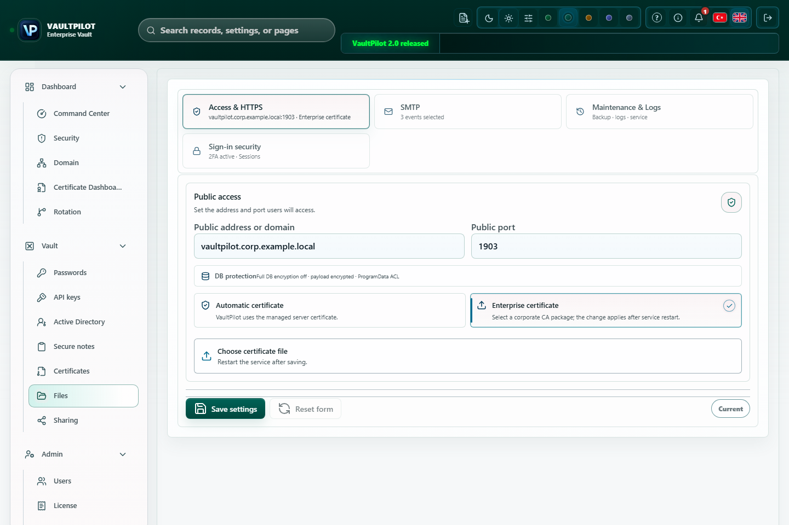

# Server System Ayarları

Owner rolündeki operatör dış erişim adresini, HTTPS güvenini, bildirimleri, logları ve bakım sınırlarını gözden geçirmek istediğinde Server System ekranını kullanır. Bu sayfa [Public host ve HTTPS](public-host-https-certificate.md) rehberinin operasyon tamamlayıcısıdır.

Yukarıdaki ekran görüntüsü izole bir çalışma ortamında sentetik yapılandırmayla alınmış, yayıma uygun hale getirilmiş bir UI görselidir. Görünen host, port, deneme durumu, 2FA durumu ve eklenti sayıları yalnızca dokümantasyon örneğidir. Bu görsel release asset kanıtı veya production rehberi değildir.

## Bu Ekran Neyi Yönetir

| Alan | Operatör aksiyonu | Public güvenli kanıt |
| --- | --- | --- |
| Erişim ve HTTPS | Public host, public port, yönetilen HTTPS durumu ve sertifika paketi durumunu gözden geçirir. | Gerçek değer yerine `<SERVER_HOST>` kullanılan host biçimi, port ve sertifika subject/SAN özeti. |
| Bildirimler | E-posta bildirimleri açıksa SMTP host, port, gönderen adres ve test sonucunu doğrular. | SMTP sağlayıcı ailesi, redakte edilmiş gönderen domain'i ve son test zamanı. |
| Loglar ve bakım | Log saklama, audit saklama, güvenli tanılama ve yeniden başlatma rehberini inceler. | Saklama değerleri, servis durumu, redakte edilmiş zaman damgaları ve secret içermeyen hata adları. |

Server System idari bir yüzeydir. Bu ayarları yalnızca Owner veya onaylı server administrator değiştirmelidir.

## Erişim Ve HTTPS Kontrol Listesi

1. Host veya port değiştirmeden önce kanonik tarayıcı URL'sini doğrulayın.
2. Hedef host ve port için firewall ve DNS yönlendirme kontrolünü yapın.
3. Geniş üretim erişimi için trusted PFX/P12 sertifika paketi kullanın.
4. Paket parolasını ekran görüntüsü, log, ticket veya dokümana koymayın.
5. Yapılandırmayı kaydedin.
6. Yalnızca VaultPilot isterse yeniden başlatma veya reload yapın.
7. Bir client makineden `https://<HOST>:<PORT>` açın ve tarayıcı sertifika durumunu doğrulayın.

HTTPS açıldıktan sonra tarayıcı uyarı veriyorsa [HTTPS sertifika uyarısı](../../kb/tr/certificate-warning.md) makalesini kullanın.

## Bildirim Kontrol Listesi

Bildirim ayarlarını yalnızca security, update veya idari uyarılar gibi operasyon e-postaları için kullanın.

| Kontrol | Sağlıklı sonuç |
| --- | --- |
| SMTP host ve port | Onaylı mail relay ile eşleşir. |
| Sender adresi | Onaylı operasyon posta kutusunu kullanır. |
| Kimlik bilgisi yönetimi | Parola veya uygulama secret'ı yalnızca UI içinde girilir, herkese açık şekilde paylaşılmaz. |
| Test sonucu | Onaylı alıcıya vault verisi sızdırmadan gönderim yapar. |

SMTP parolalarını, uygulama parolalarını veya müşteri verisi içeren mesaj gövdelerini herkese açık issue içine koymayın.

## Log Ve Bakım Kontrol Listesi

| Ayar | Operatör beklentisi |
| --- | --- |
| Log saklama | Destek ve audit incelemesi için yeterli, gereksiz operasyon gürültüsünü sınırlayacak kadar kısa. |
| Audit saklama | Kurumun uyumluluk ve olay inceleme ihtiyacıyla uyumlu. |
| Tanılama | Ortam dışına çıkmadan önce redakte edilmiş. |
| Yeniden başlatma rehberi | Yalnızca yapılandırma değişikliği, güncelleme veya açık destek yönlendirmesi yeniden başlatma istediğinde kullanılır. |

Owner bakım temizliği rutin sorun giderme değildir; önce yedek alan bir bakım aksiyonudur. Yalnız `AUDIT`, `DISCOVERY` veya `EXECUTIONS` kayıtlarını hedefleyebilir. İstek backup-clear modunu kullanmıyorsa VaultPilot temizliği reddeder ve `MAINTENANCE_BACKUP_REQUIRED` döndürür.

Temizlik çalıştığında VaultPilot seçilen kategoriyi temizlemeden önce `vaultpilot-maintenance-<scope>-<timestamp>-<id>.json` adlı bakım yedeği dosyası yazar. Geri yükleme yalnız o kategoriyi etkiler; yedek sonrasında oluşan kayıtlar değişebilir veya kaybolabilir. Geri yükleme uyarısı `RESTORE_REPLACES_NEWER_CATEGORY_RECORDS` değeridir.

Bakım temizliği kasa secret'larını, kaynak dosyaları, servis loglarını, database'i, yedekleri, sertifikaları veya müşteri verisini hedeflemez. Bakım yedeği JSON dosyasını herkese açık olarak eklemeyin; yalnız onaylı private support kanalında tutun.

## Güvenli Destek Kanıtı

Toplayın:

- VaultPilot sürümü ve kurulu servis adı.
- Gerçek host yerine `<SERVER_HOST>` kullanılan public host biçimi.
- Yapılandırılmış port.
- HTTPS durumu ve sertifika subject/SAN özeti.
- Bildirim test zamanı ve secret içermeyen hata adı.
- Log ve audit retention değerleri.
- UI tarafından yeniden başlatma istenip istenmediği.

Toplamayın:

- Sertifika paketleri, private key'ler veya sertifika parolaları.
- SMTP parolaları, app password değerleri, cookie'ler veya API token'ları.
- Secret içerebilecek ham loglar.
- Gerçek kullanıcı, internal URL veya secret kayıtları gösteren ekran görüntüleri.

İlgili:

- [Public host ve HTTPS](public-host-https-certificate.md)
- [Operasyon runbook](operator-runbook.md)
- [Sorun giderme](troubleshooting.md)
- [Bilgi bankası: Server settings restart ve bakım](../../kb/tr/server-settings-restart-maintenance.md)
